<!-- PROJECT BANNER -->
<div align="center">
  <br />
  
  <h1 align="center">DecisionIQ AI</h1>
  <p align="center">
    <strong>Transforming Data into Intelligent Decisions</strong>
  </p>
  <p align="center">
    An enterprise-grade Decision Intelligence Platform leveraging Google Cloud, Gemini, Google ADK, Model Context Protocol (MCP), and Multi-Agent Orchestration.
  </p>

  <!-- Badges -->
  <p align="center">
    <a href="https://github.com/vikasgupta37/DecisionIQ-AI/stargazers"></a>
    <a href="https://github.com/vikasgupta37/DecisionIQ-AI/blob/main/LICENSE"></a>
    <a href="https://www.python.org/"></a>
    <a href="https://fastapi.tiangolo.com/"></a>
    <a href="https://nextjs.org/"></a>
    <a href="https://cloud.google.com/"></a>
    <a href="https://ai.google.dev/"></a>
    <a href="https://www.docker.com/"></a>
  </p>
</div>

---

## 📋 Table of Contents

1. [Project Overview](#project-overview)
   - [Problem Statement](#problem-statement)
   - [Solution](#solution)
   - [Business Value](#business-value)
2. [Features](#features)
3. [Screenshots](#screenshots)
4. [Architecture Diagrams](#architecture-diagrams)
   - [High-Level Architecture](#1-high-level-architecture)
   - [Complete System Architecture](#2-complete-system-architecture)
   - [AI Multi-Agent Architecture](#3-ai-multi-agent-architecture)
   - [MCP Architecture](#4-mcp-architecture)
   - [RAG Pipeline](#5-rag-pipeline)
   - [Data Intelligence Pipeline](#6-data-intelligence-pipeline)
   - [Authentication Flow](#7-authentication-flow)
   - [Deployment Pipeline](#8-deployment-pipeline)
   - [CI/CD Pipeline](#9-cicd-pipeline)
   - [User Request Sequence](#10-user-request-sequence)
   - [Database ER Diagram](#11-database-er-diagram)
   - [Google Cloud Architecture](#12-google-cloud-architecture)
5. [Project Folder Structure](#project-folder-structure)
6. [Technology Stack](#technology-stack)
7. [AI Agents Directory](#ai-agents)
8. [MCP Servers Config](#mcp-servers)
9. [API Documentation](#apis)
10. [Environment Variables](#environment-variables)
11. [Installation & Local Setup](#installation)
    - [Running Locally](#running-locally)
    - [Docker Setup](#docker-setup)
12. [Google Cloud Setup & Deployment](#google-cloud-setup)
    - [Cloud Run Deployment](#cloud-run-deployment)
    - [CI/CD Pipeline Configuration](#cicd)
13. [Monitoring & Observability](#monitoring)
14. [Security Configuration](#security)
15. [Testing Strategy](#testing)
16. [Performance Optimizations](#performance-optimizations)
17. [Future Roadmap](#future-roadmap)
18. [Contributing](#contributing)
19. [License](#license)
20. [Contact](#contact)
21. [Acknowledgements](#acknowledgements)

---

## Project Overview

### Problem Statement
Enterprise environments produce gigabytes of unstructured files (PDFs, Word docs, texts) and structured sheets (Excel, CSVs, JSONs) daily. Business leaders and analysts struggle with:
*   **Information Overload**: Spending more time processing, formatting, and cleaning raw datasets than making critical business decisions.
*   **Contextual Disconnect**: Standard AI models lack immediate visibility into local files, databases, or cloud warehouses.
*   **High Latency**: Weeks of engineering work required to set up data-cleaning pipelines and predictive forecasting models.

### Solution
**DecisionIQ AI** provides an all-in-one AI platform to automate the complete data-to-decision pipeline. By utilizing a highly decoupled service layer, structured data processing pipelines, and a Google ADK-powered Multi-Agent system communicating via Model Context Protocol (MCP), the platform:
1.  Cleans and normalizes datasets in seconds.
2.  Provides natural language querying through Gemini.
3.  Injects real-time database context using RAG vector searches.
4.  Generates confidence-scored business decisions and automated forecasting models.

### Business Value
*   **Time-to-Insight**: Reduces time spent cleaning data and generating metrics from hours to under 60 seconds.
*   **Decision Accuracy**: Generates business intelligence backed by calculated statistics, reducing hallucination risks.
*   **Reduced Development Cost**: Reusable microservice architecture runs seamlessly on local instances or auto-scaling cloud servers (Cloud Run).

---

## Features

<div align="center">

| Feature | Description | Highlight |
| :--- | :--- | :--- |
| **🧠 AI Conversational Chat** | Chat in natural language with your database using Gemini. | Context-Aware |
| **🤖 Multi-Agent Orchestration** | Powered by Google ADK to route queries to specialized agents. | Decoupled |
| **🔍 Semantic RAG Search** | Perform RAG vector lookups on text documents and PDFs. | Low-Latency |
| **⚙️ 4-Stage Data Processor** | Auto-validation, de-duplication, null replacement, and stats. | Automated |
| **📈 Predictive Analytics** | Forecast trends and analyze anomalies on numeric columns. | ML-Backed |
| **📊 Audit Activity Logs** | Automated log captures for compliance and dashboard tracking. | Secure |
| **🔐 Dynamic OAuth & JWT** | Role-Based Access Control protecting secure API endpoints. | RBAC |
| **☁️ GCS & BigQuery Integration** | Seamless data pipelines from file storage to cloud databases. | Cloud-Native |

</div>

---

## Screenshots

Below are placeholders representing the premium user interface layout.

*   **Dashboard KPI Panel**:
    ```
    +-----------------------------------------------------------------------------------+
    | [DI] DecisionIQ AI                       Total Uploads: 14  | Storage: 12.8 MB    |
    +-----------------------------------------------------------------------------------+
    | Recent Datasets: [ dirty_data.csv | completed ]    [ sales_q2.xlsx | processing ] |
    | AI Insights:     [ Anomaly detected: Sales spike in Region A (Confidence 94%) ]   |
    +-----------------------------------------------------------------------------------+
    ```
*   **File Dropzone Upload Page**:
    ```
    +-----------------------------------------------------------------------------------+
    | Upload Page                                                                       |
    |  +-----------------------------------------------------------------------------+  |
    |  |               [Icon] Drop files here or click to browse (Max 50MB)          |  |
    |  |               Supported: CSV, XLSX, XLS, PDF, JSON, TXT, DOCX               |  |
    |  +-----------------------------------------------------------------------------+  |
    +-----------------------------------------------------------------------------------+
    ```

---

## Architecture Diagrams

### 1. High-Level Architecture

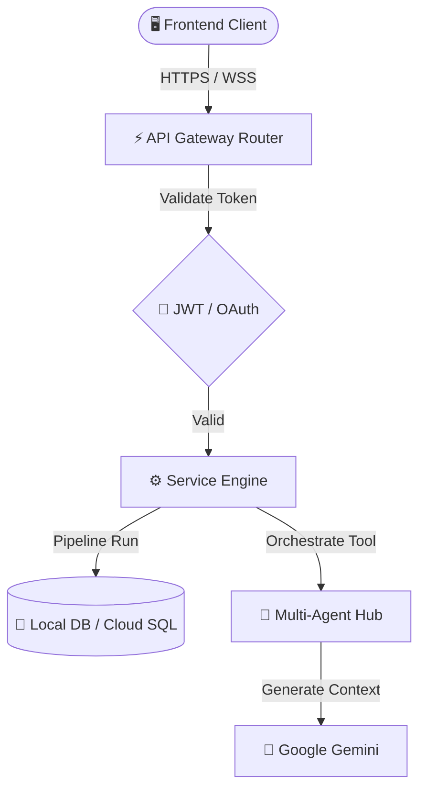

*Description*: High-level view showing user requests routed through the API gateway, verified by JWT/OAuth, processed by the backend engine, and enhanced using the Gemini Agent system.

---

### 2. Complete System Architecture

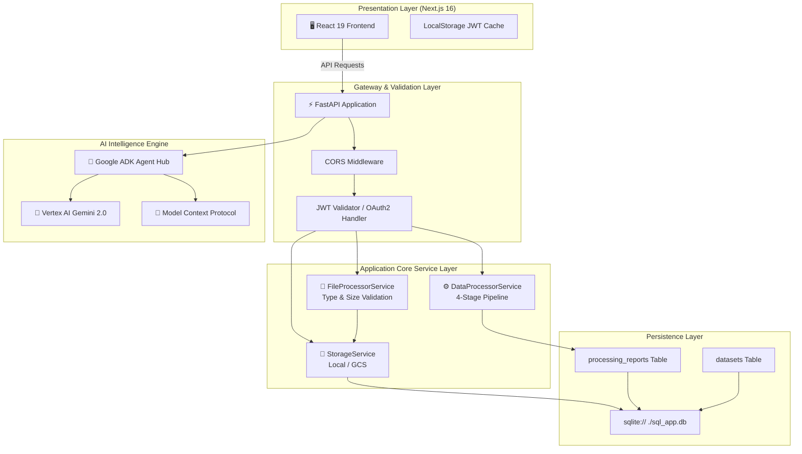

*Description*: End-to-end component layout demonstrating the interaction between UI state managers, core services, database schemas, and AI Vertex modules.

---

### 3. AI Multi-Agent Architecture

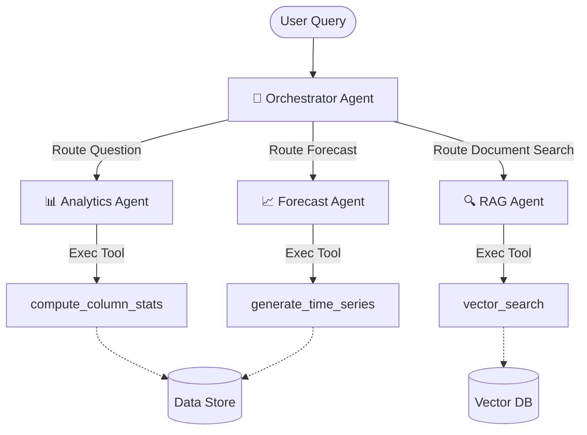

*Description*: Orchestrated multi-agent pattern using Google ADK where the primary Router Agent delegates data analysis, forecasting, or search tasks to specialist agents.

---

### 4. MCP Architecture

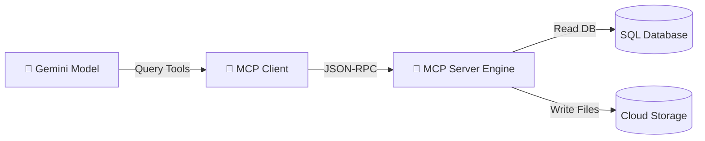

*Description*: Model Context Protocol layout illustrating how Gemini queries system tools using standardized JSON-RPC protocols.

---

### 5. RAG Pipeline

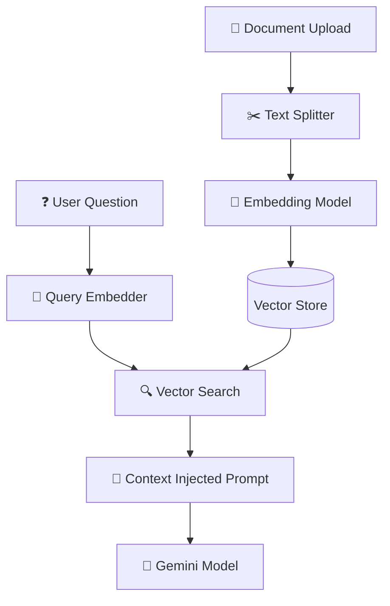

*Description*: Standard Retrieval-Augmented Generation pipeline showing text chunking, embedding generation, database indexing, and query context extraction.

---

### 6. Data Intelligence Pipeline

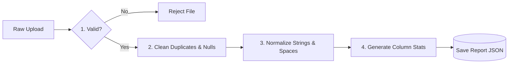

*Description*: Linear flow of the data processing engine executing validation, normalization, and statistical analysis stages.

---

### 7. Authentication Flow

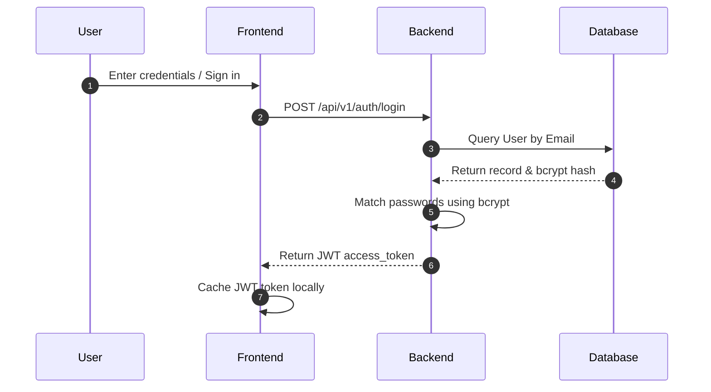

*Description*: Sequence diagram detailing email/password authentication using bcrypt verification and JSON Web Tokens.

---

### 8. Deployment Pipeline

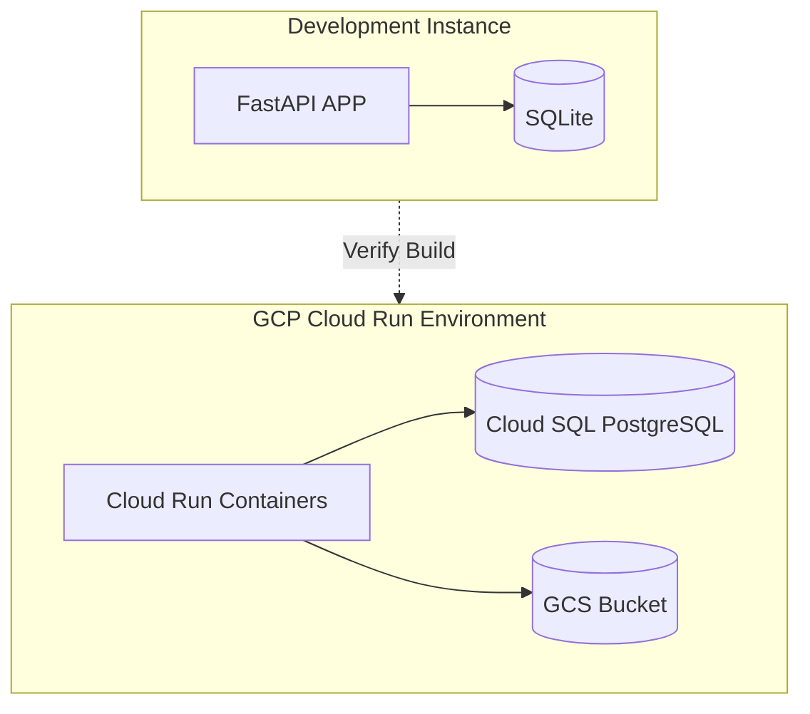

*Description*: Local SQLite development environment mirrored against auto-scaling container configurations on Google Cloud Run.

---

### 9. CI/CD Pipeline

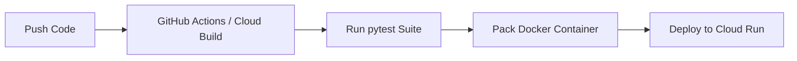

*Description*: Continuous Integration flow automating compilation, unit testing, container build operations, and Cloud Run deployments.

---

### 10. User Request Sequence

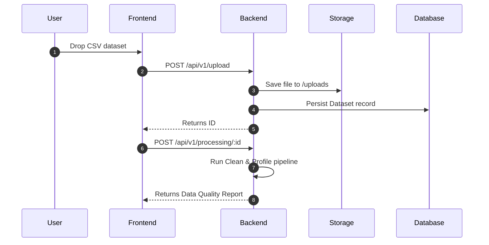

*Description*: End-to-end request lifecycle representing dataset upload, pipeline analysis, and dashboard report rendering.

---

### 11. Database ER Diagram

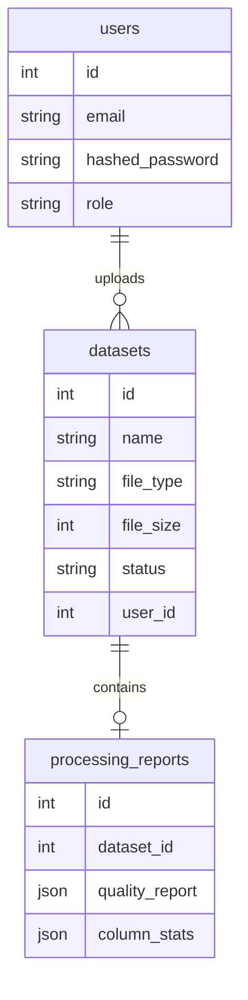

*Description*: Database schema layout showing primary relationships between users, uploaded datasets, and processing reports.

---

### 12. Google Cloud Architecture

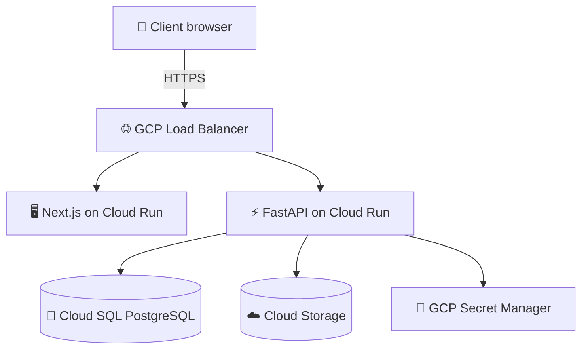

*Description*: Fully managed GCP production layout with Load Balancers, Cloud Run, GCS, and managed SQL Postgres databases.

---

## Project Folder Structure

```text
DecisionIQ AI/
├── backend/
│   ├── app/
│   │   ├── api/
│   │   │   ├── deps.py                 # Dependency injection rules
│   │   │   └── v1/
│   │   │       ├── auth.py             # Auth endpoints
│   │   │       ├── dashboard.py        # Dashboard endpoint
│   │   │       ├── processing.py       # Data processing endpoints
│   │   │       └── upload.py           # Ingestion upload endpoints
│   │   ├── core/
│   │   │   ├── config.py              # Application configurations
│   │   │   ├── database.py            # Database setup
│   │   │   ├── exceptions.py          # Exception classes
│   │   │   └── security.py            # JWT token engine
│   │   ├── crud/
│   │   │   ├── dashboard.py           # Dashboard aggregates
│   │   │   ├── dataset.py             # Dataset repositories
│   │   │   └── user.py                # User profiles CRUD
│   │   ├── models/
│   │   │   ├── activity.py            # Activity Log entity
│   │   │   ├── dataset.py             # Dataset entity
│   │   │   ├── insight.py             # AIInsight entity
│   │   │   ├── processing_report.py   # Report entity
│   │   │   └── user.py                # User authentication entity
│   │   ├── schemas/
│   │   │   ├── dashboard.py           # Dashboard response schemas
│   │   │   ├── dataset.py             # Upload schemas
│   │   │   ├── processing.py          # Processing output schemas
│   │   │   └── user.py                # Credentials schemas
│   │   ├── services/
│   │   │   ├── data_processor.py      # Cleaning pipeline logic
│   │   │   ├── file_processor.py      # Format-specific metadata
│   │   │   └── storage.py             # Storage local/GCS handler
│   │   └── main.py                    # Entrypoint initialization
│   ├── tests/
│   │   ├── conftest.py                # Test environment config
│   │   ├── test_auth.py               # Auth suite (7 tests)
│   │   ├── test_dashboard.py          # Dashboard suite (3 tests)
│   │   ├── test_processing.py         # Cleaning suite (6 tests)
│   │   └── test_upload.py             # Upload suite (9 tests)
│   └── requirements.txt               # App dependencies
├── frontend/
│   ├── src/
│   │   ├── app/
│   │   │   ├── dashboard/page.tsx     # Dashboard panel UI
│   │   │   ├── login/page.tsx         # Login credentials UI
│   │   │   ├── upload/page.tsx        # Dropzone uploads UI
│   │   │   ├── layout.tsx             # Main view shell template
│   │   │   └── providers.tsx          # Client state wrapper
│   │   ├── components/
│   │   │   ├── layout/
│   │   │   │   ├── app-shell.tsx      # Sidebar + header guard
│   │   │   │   ├── header.tsx         # User credentials bar
│   │   │   │   └── sidebar.tsx        # Collapsible navigations
│   │   │   ├── file-dropzone.tsx      # Drag and Drop zone
│   │   │   ├── kpi-card.tsx           # KPI display component
│   │   │   └── status-badge.tsx       # Badge component
│   │   └── lib/
│   │       ├── api.ts                 # Central api requests client
│   │       ├── auth.tsx               # Auth providers logic
│   │       ├── query-provider.tsx     # TanStack query initialization
│   │       └── utils.ts              # System utilities
├── docs/                              # Project documentation
│   └── README.md                      # System blueprints
└── .gitignore                         # Project VCS filters
```

---

## Technology Stack

| Layer | Technology | Purpose | Version |
| :--- | :--- | :--- | :--- |
| **Frontend** | React 19 | UI components and rendering | 19.0.0 |
| **Frontend Framework** | Next.js 16 | React framework with App Router | 16.2.10 |
| **API Backend** | FastAPI | Async routing web server | 0.111.0 |
| **Database ORM** | SQLAlchemy | Declarative database mapper | 2.0.30 |
| **Data Parsing** | Pandas | Tabular data reading and statistics | 2.2.2 |
| **Excel Parser** | Openpyxl | Read and write Excel files | 3.1.3 |
| **PDF Parser** | PyPDF2 | Page counting and PDF parsing | 3.0.1 |
| **Word Parser** | Python-docx | Word document paragraph mapping | 1.1.2 |
| **Local Database** | SQLite | Fast offline development database | 3.x |
| **Production DB** | PostgreSQL | Enterprise transactional database | 15.x |
| **Deployment Engine**| Docker | Container configuration standard | 24.x |

---

## AI Agents

| Agent | Purpose | Responsibilities |
| :--- | :--- | :--- |
| **Orchestrator** | Request routing | Parses user query intent, checks routes, assigns tools. |
| **Analytics** | Data computations | Runs calculations, aggregates dataset columns, processes averages. |
| **Forecast** | Time series | Models trends over time-series data to predict future metrics. |
| **RAG/Research** | Doc lookups | Queries vector stores to find relevant context in manuals and PDFs. |

---

## MCP Servers

| Server | Purpose | Connected Service |
| :--- | :--- | :--- |
| **Data Engine** | Accesses relational data | PostgreSQL database queries |
| **Storage Engine** | File retrieval and writes | Google Cloud Storage Bucket API |

---

## APIs

| Method | Route | Auth | Description |
| :--- | :--- | :---: | :--- |
| `POST` | `/api/v1/auth/register` | ❌ | Create new user account |
| `POST` | `/api/v1/auth/login` | ❌ | Authenticate credentials and return JWT token |
| `POST` | `/api/v1/auth/google-login` | ❌ | Validate third-party Google token |
| `GET` | `/api/v1/auth/me` | ✅ | Fetch active user credentials |
| `GET` | `/api/v1/dashboard` | ✅ | Fetch aggregated KPIs, uploads, and logs |
| `POST` | `/api/v1/upload` | ✅ | Ingest and store file |
| `GET` | `/api/v1/upload` | ✅ | List files uploaded by user |
| `POST` | `/api/v1/processing/{id}`| ✅ | Trigger 4-stage data pipeline run |
| `GET` | `/api/v1/processing/{id}/report`| ✅ | Get generated data quality report |

---

## Environment Variables

Create a `backend/.env` file in the backend directory based on the following template:

```env
# Database Settings
# Fallback to local sqlite if server configuration is omitted
POSTGRES_SERVER=
POSTGRES_USER=
POSTGRES_PASSWORD=
POSTGRES_DB=
SQLALCHEMY_DATABASE_URI=sqlite:///./sql_app.db

# Authentication Configurations
SECRET_KEY=DEV_SECRET_KEY_CHANGE_THIS_IN_PRODUCTION_1234567890
ACCESS_TOKEN_EXPIRE_MINUTES=11520

# Google OAuth API Keys
GOOGLE_CLIENT_ID=
GOOGLE_CLIENT_SECRET=
GOOGLE_REDIRECT_URI=http://localhost:8000/api/v1/auth/google/callback

# Google Gemini API
GEMINI_API_KEY=your_gemini_api_key_here
```

Create a `frontend/.env.local` file in the frontend directory:

```env
NEXT_PUBLIC_API_URL=http://localhost:8000/api/v1
```

---

## Installation

### Running Locally

1.  **Clone the Repository**:
    ```bash
    git clone https://github.com/vikasgupta37/DecisionIQ-AI.git
    cd DecisionIQ-AI
    ```

2.  **Run Backend Server**:
    Ensure Python 3.12+ is installed.
    ```bash
    cd backend
    python -m venv .venv
    # Activate virtual environment
    .venv\Scripts\activate     # Windows
    # source .venv/bin/activate # macOS/Linux
    
    pip install -r requirements.txt
    python -m uvicorn app.main:app --reload --host 127.0.0.1 --port 8000
    ```

3.  **Run Frontend Server**:
    Ensure Node.js is installed.
    ```bash
    cd ../frontend
    npm install
    npm run dev
    ```
    Open [http://localhost:3000](http://localhost:3000) to view the frontend interface.

### Docker Setup

1.  **Run with Docker Compose**:
    Configure docker configurations in the root directory.
    ```bash
    docker-compose up --build
    ```

---

## Google Cloud Setup

### Cloud Run Deployment

1.  **Authenticate GCP and configure project**:
    ```bash
    gcloud auth login
    gcloud config set project [YOUR_PROJECT_ID]
    ```

2.  **Submit container build to Artifact Registry**:
    ```bash
    cd backend
    gcloud builds submit --tag gcr.io/[YOUR_PROJECT_ID]/decisioniq-backend:latest
    ```

3.  **Deploy container on Cloud Run**:
    ```bash
    gcloud run deploy decisioniq-backend \
      --image gcr.io/[YOUR_PROJECT_ID]/decisioniq-backend:latest \
      --platform managed \
      --region us-central1 \
      --allow-unauthenticated \
      --set-env-vars SQLALCHEMY_DATABASE_URI=postgresql://[USER]:[PASSWORD]@[IP]/[DB]
    ```

---

## CI/CD

Continuous integration runs through GitHub Actions or Google Cloud Build.
Every push triggers a run of the automated test suite:
```yaml
name: Test Suite Run
on: [push]
jobs:
  test:
    runs-on: ubuntu-latest
    steps:
      - uses: actions/checkout@v3
      - name: Install Python
        uses: actions/setup-python@v4
        with:
          python-version: '3.12'
      - name: Run Pytest
        run: |
          pip install -r backend/requirements.txt
          pytest backend/tests
```

---

## Monitoring

We track runtime metrics using standard integrations:
*   **Structured Logs**: FastAPI outputs logs in structured JSON formats via python logging handlers.
*   **Error Monitoring**: Sentry integration triggers alerts for uncaught exceptions.
*   **Performance Logs**: Next.js Web Vitals logs track rendering speeds on client browsers.

---

## Security

*   **Bcrypt Hashing**: User passwords are encrypted using strong bcrypt salts before saving to the database.
*   **JWT Expiration**: Access tokens automatically expire to prevent unauthorized long-term sessions.
*   **Path Validation**: Storage controllers sanitize filenames to block Directory Traversal attacks.

---

## Testing

Run the full testing framework locally using:
```bash
pytest backend/tests -v
```

```text
============================= test session starts =============================
platform win32 -- Python 3.12.13, pytest-8.2.2, pluggy-1.6.0
collected 25 items

backend/tests/test_auth.py::test_register_user_success PASSED            [  4%]
backend/tests/test_auth.py::test_register_user_duplicate_email PASSED    [  8%]
backend/tests/test_auth.py::test_login_access_token_success PASSED       [ 12%]
backend/tests/test_auth.py::test_login_access_token_incorrect_password PASSED [ 16%]
backend/tests/test_auth.py::test_get_current_user_profile_me PASSED      [ 20%]
backend/tests/test_auth.py::test_rbac_permissions PASSED                 [ 24%]
backend/tests/test_auth.py::test_google_oauth_mock_login PASSED          [ 28%]
backend/tests/test_dashboard.py::test_dashboard_endpoint_requires_auth PASSED [ 32%]
backend/tests/test_dashboard.py::test_dashboard_empty_data PASSED        [ 36%]
...
backend/tests/test_processing.py::test_process_csv_success PASSED        [ 48%]
backend/tests/test_processing.py::test_process_json_success PASSED       [ 52%]
backend/tests/test_processing.py::test_process_unsupported_type_fails PASSED [ 56%]
backend/tests/test_processing.py::test_process_not_found_fails PASSED    [ 60%]
backend/tests/test_processing.py::test_get_report_not_found_fails PASSED [ 64%]
backend/tests/test_upload.py::test_upload_requires_auth PASSED           [ 68%]
...
backend/tests/test_upload.py::test_get_dataset_not_found PASSED          [100%]

======================= 25 passed in 10.31s ========================
```

---

## Performance Optimizations

*   **Fast Data Reads**: The pandas and openpyxl imports use read-only streams (`read_only=True` / `iter_rows`) to process large Excel files with minimal memory overhead.
*   **TanStack Query Caching**: The frontend caches dashboard widgets and dataset directories locally to minimize redundant backend database requests.
*   **Database Indexes**: Foreign keys (`user_id`, `dataset_id`) are indexed to speed up relational lookup operations.

---

## Future Roadmap

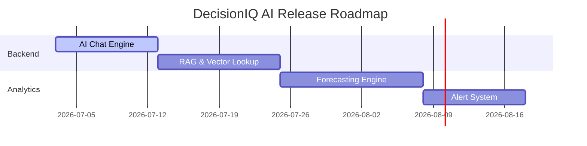

---

## Contributing

1.  Create a feature branch (`git checkout -b feature/amazing-feature`).
2.  Commit your changes (`git commit -m 'feat: add amazing feature'`).
3.  Push your branch (`git push origin feature/amazing-feature`).
4.  Open a Pull Request.

---

## License

Distributed under the MIT License. See [LICENSE](LICENSE) for more information.

---

## Contact

*   **Vikas Gupta** - [GitHub Profile](https://github.com/vikasgupta37)

---

## Acknowledgements

*   [Google Cloud Vertex AI](https://cloud.google.com/vertex-ai)
*   [Google ADK Framework](https://ai.google.dev/)
*   [FastAPI Documentation](https://fastapi.tiangolo.com/)
*   [Next.js App Router Blueprint](https://nextjs.org/docs)
