<div align="center">

# 🧠 DecisionIQ AI

### Transforming Data into Intelligent Decisions

[](https://python.org)
[](https://fastapi.tiangolo.com)
[](https://nextjs.org)
[](https://react.dev)
[](https://typescriptlang.org)
[](https://cloud.google.com)
[](https://ai.google.dev)
[](LICENSE)

---

**An enterprise-grade AI-powered Decision Intelligence Platform that enables organizations to upload structured and unstructured data, process it through intelligent pipelines, analyze with Google Gemini, generate business insights, predict trends, and deliver actionable recommendations through a multi-agent architecture.**

[Live Demo](#demo) · [Architecture](#high-level-system-architecture) · [Documentation](docs/) · [API Reference](docs/api.md) · [Deployment Guide](docs/deployment.md)

</div>

---

## 📋 Table of Contents

- [Executive Summary](#executive-summary)
- [Problem Statement](#problem-statement)
- [Solution Overview](#solution-overview)
- [Key Features](#key-features)
- [Technology Stack](#technology-stack)
- [High-Level System Architecture](#high-level-system-architecture)
- [System Context Diagram](#system-context-diagram)
- [Component Architecture](#component-architecture)
- [Frontend Architecture](#frontend-architecture)
- [Backend Architecture](#backend-architecture)
- [AI Multi-Agent Architecture](#ai-multi-agent-architecture)
- [Data Processing Pipeline](#data-processing-pipeline)
- [Authentication Flow](#authentication-flow)
- [File Upload Flow](#file-upload-flow)
- [Database ER Diagram](#database-er-diagram)
- [Folder Structure](#folder-structure)
- [API Architecture](#api-architecture)
- [Security Architecture](#security-architecture)
- [Deployment Architecture](#deployment-architecture)
- [Getting Started](#getting-started)
- [Business Value](#business-value)
- [Future Enhancements](#future-enhancements)

---

## Executive Summary

**DecisionIQ AI** is an enterprise-grade Decision Intelligence Platform designed to bridge the gap between raw data and actionable business decisions. Built on a modern, scalable architecture using **Google Cloud**, **Gemini AI**, **Google ADK (Agent Development Kit)**, **Model Context Protocol (MCP)**, and **Retrieval-Augmented Generation (RAG)**, the platform empowers business users, data analysts, and decision-makers with:

- **Automated Data Ingestion** — Upload CSV, Excel, PDF, JSON, TXT, and DOCX files with instant metadata extraction.
- **Intelligent Data Processing** — Four-stage pipeline performing validation, cleaning, normalization, and statistical profiling.
- **AI-Powered Insights** — Natural language conversations with Gemini to discover trends, anomalies, and recommendations.
- **Predictive Analytics** — Time-series forecasting and scenario modeling for forward-looking business planning.
- **Decision Engine** — Multi-agent orchestration that synthesizes data signals into ranked, confidence-scored recommendations.

The platform follows **Clean Architecture** principles, **Domain-Driven Design (DDD)**, and **SOLID** patterns with a clear separation of concerns across the API layer, service layer, repository pattern, and domain models.

---

## Problem Statement

Modern enterprises face critical challenges in data-driven decision making:

| Challenge | Impact |
|---|---|
| **Data Silos** | Business data scattered across CSV files, spreadsheets, PDFs, and databases |
| **Manual Analysis** | Analysts spend 60-80% of time cleaning and preparing data |
| **Insight Latency** | Weeks between data collection and actionable intelligence |
| **Decision Bottlenecks** | Key decisions delayed due to lack of synthesized, contextual information |
| **Tool Fragmentation** | Teams juggle multiple disconnected tools for analytics, reporting, and forecasting |

---

## Solution Overview

DecisionIQ AI addresses these challenges through a unified platform that automates the entire data-to-decision pipeline:


**From raw data to intelligent decisions in minutes, not weeks.**

---

## Key Features

| Category | Features |
|---|---|
| 🔐 **Authentication** | Google OAuth 2.0, JWT tokens, Role-Based Access Control (Admin, Analyst, Business User, Auditor) |
| 📂 **Data Ingestion** | Multi-format upload (CSV, Excel, PDF, JSON, TXT, DOCX), drag-and-drop UI, metadata extraction |
| ⚙️ **Data Processing** | 4-stage pipeline: Validation → Cleaning → Normalization → Statistical Profiling |
| 🧠 **AI Chat** | Natural language queries powered by Google Gemini with context-aware responses |
| 📊 **Dashboard** | Real-time KPI cards, upload status tracking, AI insights panel, activity feed |
| 🔍 **RAG Search** | Retrieval-Augmented Generation for document-aware AI responses |
| 📈 **Predictive Analytics** | Trend analysis, anomaly detection, forecasting |
| 📝 **Report Generation** | Automated business intelligence reports |
| 🔔 **Notifications** | Real-time alerts for anomalies and processing completion |
| 🏗️ **Enterprise Architecture** | Clean Architecture, DDD, Repository Pattern, Service Layer, Dependency Injection |

---

## Technology Stack

### Backend
| Technology | Purpose | Version |
|---|---|---|
| **Python** | Core runtime | 3.12+ |
| **FastAPI** | API framework | 0.111 |
| **SQLAlchemy** | ORM / database | 2.0 |
| **Pydantic** | Validation & schemas | 2.7 |
| **Alembic** | Database migrations | 1.13 |
| **PyJWT** | JWT token management | 2.8 |
| **Bcrypt** | Password hashing | Native |
| **Pandas** | Data manipulation | 2.2 |
| **PyPDF2** | PDF processing | 3.0 |
| **python-docx** | DOCX processing | 1.1 |
| **openpyxl** | Excel processing | 3.1 |

### Frontend
| Technology | Purpose | Version |
|---|---|---|
| **Next.js** | React framework | 16 (App Router) |
| **React** | UI library | 19 |
| **TypeScript** | Type safety | 5.x |
| **Tailwind CSS** | Utility-first styling | 4.x |
| **TanStack Query** | Server state management | 5.x |

### Google Cloud Services (Production-Ready)
| Service | Purpose |
|---|---|
| **Cloud Run** | Containerized backend deployment |
| **Cloud SQL** | Managed PostgreSQL |
| **Cloud Storage (GCS)** | File storage for uploaded datasets |
| **BigQuery** | Large-scale analytics warehouse |
| **Vertex AI** | Gemini model hosting |
| **Secret Manager** | Credential and key management |
| **Cloud Build** | CI/CD pipeline |
| **Cloud Monitoring** | Observability and alerting |

### AI & Intelligence
| Technology | Purpose |
|---|---|
| **Google Gemini** | LLM for natural language insights |
| **Google ADK** | Multi-agent orchestration framework |
| **MCP (Model Context Protocol)** | Standardized tool-model communication |
| **RAG** | Context-augmented retrieval for grounded responses |

---

## High-Level System Architecture

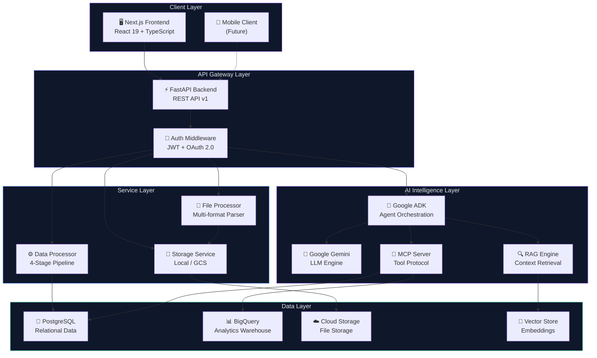

**Explanation:** The platform follows a layered architecture with clear separation between presentation, API gateway, business services, AI intelligence, and data persistence. Each layer communicates through well-defined interfaces, enabling independent scaling and technology evolution.

---

## System Context Diagram

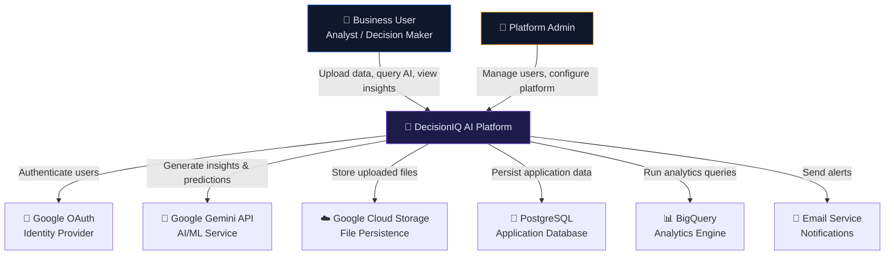

**Explanation:** The System Context Diagram (C4 Level 1) shows DecisionIQ AI as the central system, with its primary actors (Business Users and Admins) and external dependencies (Google services, database, email). This view communicates the platform's integration boundaries to stakeholders.

---

## Component Architecture

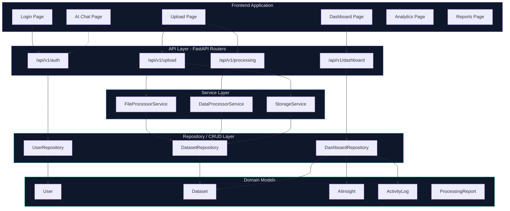

**Explanation:** The Component Architecture illustrates the Clean Architecture layers. Frontend pages communicate exclusively through versioned API routes. Each route delegates to service classes for business logic, which in turn use repository classes for data access. Domain models are pure data structures with no framework dependencies.

---

## Frontend Architecture

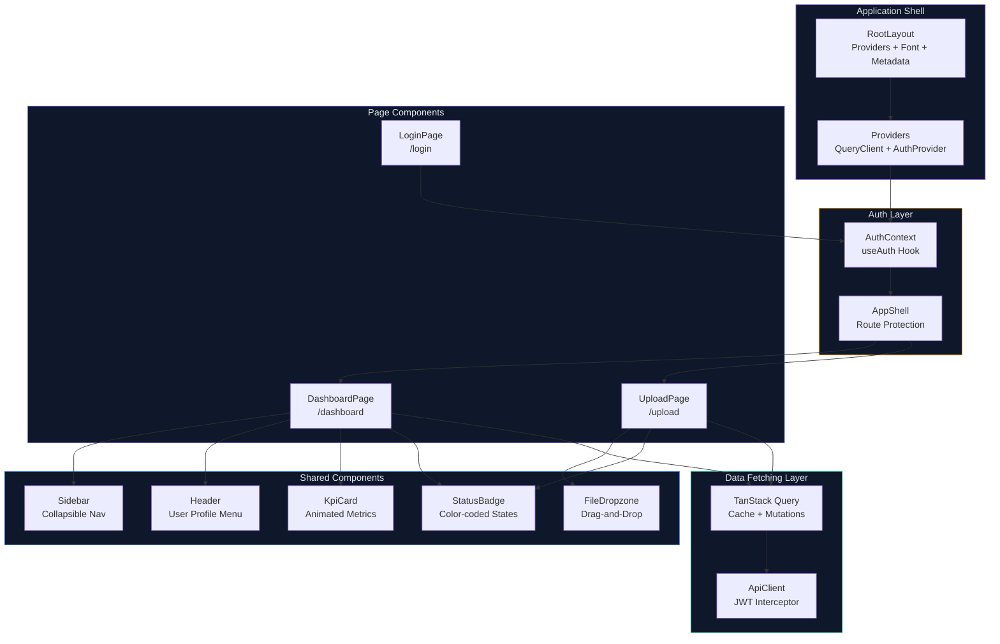

**Explanation:** The frontend follows Next.js 16 App Router patterns. The `RootLayout` wraps all pages in `QueryProvider` and `AuthProvider`. The `AppShell` component acts as an authentication guard — redirecting unauthenticated users to `/login`. All API calls flow through a centralized `ApiClient` with automatic JWT token injection.

---

## Backend Architecture

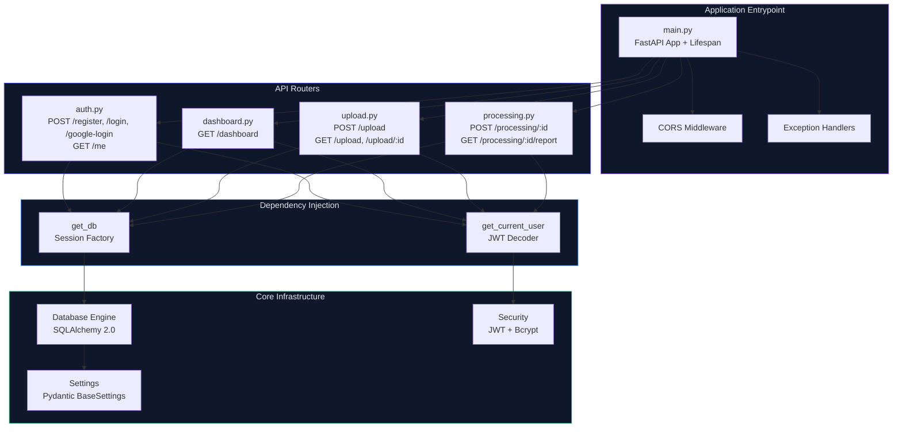

**Explanation:** The backend uses FastAPI's dependency injection system. Every router receives database sessions and authenticated user context through `Depends()`. Core infrastructure (config, database, security) is initialized once at startup and shared across all request handlers.

---

## AI Multi-Agent Architecture

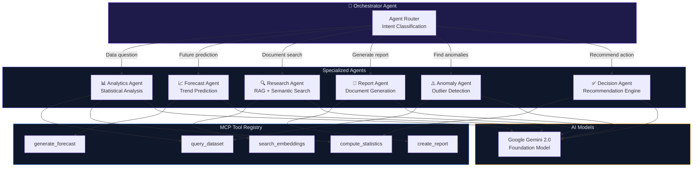

**Explanation:** The multi-agent architecture uses Google ADK to orchestrate six specialized AI agents. The Orchestrator Agent classifies user intent and delegates to the appropriate specialist. Each agent has access to MCP-registered tools for data retrieval, computation, and generation. All agents share the Gemini 2.0 foundation model for reasoning.

---

## Data Processing Pipeline

```mermaid
graph LR
    subgraph Input["📂 Input"]
        RAW["Raw File<br/>CSV / JSON / Excel"]
    end

    subgraph Stage1["Stage 1: Validation"]
        V1["Column Count Check"]
        V2["Structure Integrity"]
        V3["Malformed Row Removal"]
    end

    subgraph Stage2["Stage 2: Cleaning"]
        C1["Duplicate Detection"]
        C2["Null/NaN Handling"]
        C3["Empty Value Filling"]
    end

    subgraph Stage3["Stage 3: Normalization"]
        N1["Whitespace Trimming"]
        N2["String Standardization"]
        N3["Date Format Unification"]
    end

    subgraph Stage4["Stage 4: Profiling"]
        P1["Type Classification<br/>Numeric vs String"]
        P2["Column Statistics<br/>min/max/mean/std"]
        P3["Quality Report<br/>Completeness/Nulls/Duplicates"]
    end

    subgraph Output["📊 Output"]
        REPORT["ProcessingReport<br/>JSON Persisted"]
        STATUS["Dataset Status<br/>→ completed"]
    end

    RAW --> V1 --> V2 --> V3
    V3 --> C1 --> C2 --> C3
    C3 --> N1 --> N2 --> N3
    N3 --> P1 --> P2 --> P3
    P3 --> REPORT
    P3 --> STATUS

    style Input fill:#0f172a,stroke:#8b5cf6,color:#e2e8f0
    style Stage1 fill:#0f172a,stroke:#ef4444,color:#e2e8f0
    style Stage2 fill:#0f172a,stroke:#f59e0b,color:#e2e8f0
    style Stage3 fill:#0f172a,stroke:#3b82f6,color:#e2e8f0
    style Stage4 fill:#0f172a,stroke:#10b981,color:#e2e8f0
    style Output fill:#0f172a,stroke:#8b5cf6,color:#e2e8f0
```

**Explanation:** Every uploaded structured dataset passes through this four-stage pipeline. Stage 1 validates structural integrity. Stage 2 removes exact duplicates and fills null values with `N/A` placeholders. Stage 3 normalizes string formatting. Stage 4 computes per-column statistics and generates a comprehensive data quality report persisted as JSON in the `ProcessingReport` table.

---

## Authentication Flow

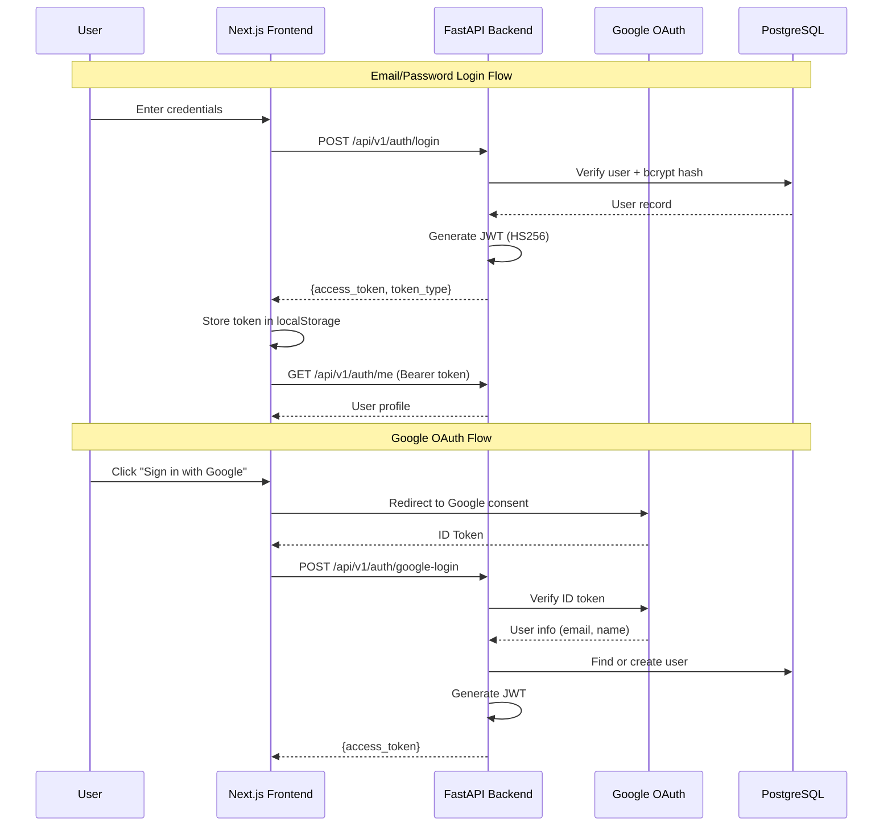

**Explanation:** The platform supports dual authentication flows. Email/password login uses bcrypt for password hashing and returns a JWT token valid for 8 days. Google OAuth verifies ID tokens server-side and auto-provisions user accounts on first login. All authenticated API calls require a `Bearer` token in the `Authorization` header.

---

## File Upload Flow

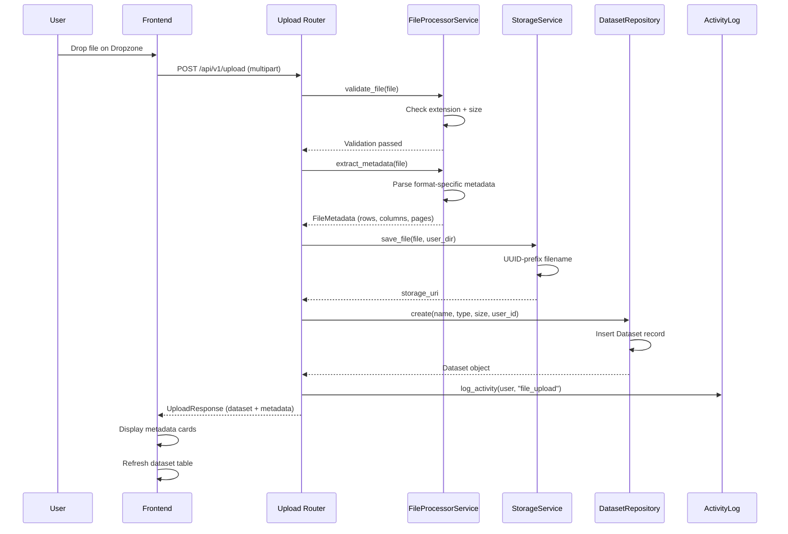

**Explanation:** The file upload flow orchestrates five discrete operations: validation (type + size), metadata extraction (format-specific parsing), storage (UUID-prefixed local/GCS persistence), database persistence (Dataset record creation), and audit logging. The frontend receives both the created dataset record and extracted metadata for immediate display.

---

## Database ER Diagram

```mermaid
erDiagram
    USER {
        int id PK
        string email UK
        string hashed_password
        string full_name
        enum role
        boolean is_active
        string avatar_url
        string google_id
        datetime created_at
        datetime updated_at
    }

    DATASET {
        int id PK
        string name
        string file_type
        int file_size
        enum status
        int row_count
        string gcs_uri
        string bq_table_id
        int user_id FK
        datetime created_at
        datetime updated_at
    }

    AI_INSIGHT {
        int id PK
        string title
        text content
        enum insight_type
        float confidence_score
        int dataset_id FK
        int user_id FK
        datetime created_at
    }

    ACTIVITY_LOG {
        int id PK
        int user_id FK
        string action
        text details
        datetime created_at
    }

    PROCESSING_REPORT {
        int id PK
        int dataset_id FK UK
        json quality_report
        json column_stats
        int original_row_count
        int cleaned_row_count
        int duplicates_removed
        int nulls_filled
        text log
        datetime created_at
    }

    USER ||--o{ DATASET : "uploads"
    USER ||--o{ AI_INSIGHT : "receives"
    USER ||--o{ ACTIVITY_LOG : "generates"
    DATASET ||--o{ AI_INSIGHT : "produces"
    DATASET ||--o| PROCESSING_REPORT : "has"
```

**Explanation:** The database schema centers on five core entities. `User` owns datasets and generates activity. `Dataset` tracks uploaded files through their lifecycle (pending → processing → completed/failed). `ProcessingReport` stores quality metrics and column statistics as JSON for flexible schema evolution. `AIInsight` captures generated business intelligence with confidence scores. `ActivityLog` provides a complete audit trail.

---

## Folder Structure

```
DecisionIQ AI/
├── backend/
│   ├── app/
│   │   ├── api/
│   │   │   ├── deps.py                 # Dependency injection (DB, Auth)
│   │   │   └── v1/
│   │   │       ├── auth.py             # Authentication endpoints
│   │   │       ├── dashboard.py        # Dashboard KPI endpoint
│   │   │       ├── upload.py           # File upload endpoints
│   │   │       └── processing.py       # Data processing endpoints
│   │   ├── core/
│   │   │   ├── config.py              # Application settings
│   │   │   ├── database.py            # SQLAlchemy engine & session
│   │   │   ├── exceptions.py          # Custom exception classes
│   │   │   └── security.py            # JWT & bcrypt utilities
│   │   ├── crud/
│   │   │   ├── user.py                # User CRUD repository
│   │   │   ├── dataset.py             # Dataset CRUD repository
│   │   │   └── dashboard.py           # Dashboard aggregation queries
│   │   ├── models/
│   │   │   ├── user.py                # User SQLAlchemy model
│   │   │   ├── dataset.py             # Dataset model + DatasetStatus enum
│   │   │   ├── insight.py             # AIInsight model
│   │   │   ├── activity.py            # ActivityLog model
│   │   │   └── processing_report.py   # ProcessingReport model
│   │   ├── schemas/
│   │   │   ├── user.py                # User Pydantic schemas
│   │   │   ├── dataset.py             # Dataset/Upload schemas
│   │   │   ├── dashboard.py           # Dashboard response schemas
│   │   │   └── processing.py          # Processing result schemas
│   │   ├── services/
│   │   │   ├── storage.py             # Storage abstraction (Local/GCS)
│   │   │   ├── file_processor.py      # File validation & metadata extraction
│   │   │   └── data_processor.py      # 4-stage processing pipeline
│   │   └── main.py                    # FastAPI application entrypoint
│   ├── tests/
│   │   ├── conftest.py                # Test fixtures (DB, client)
│   │   ├── test_auth.py               # Authentication tests (7)
│   │   ├── test_dashboard.py          # Dashboard tests (3)
│   │   ├── test_upload.py             # Upload tests (9)
│   │   └── test_processing.py         # Processing tests (6)
│   └── requirements.txt               # Python dependencies
├── frontend/
│   ├── src/
│   │   ├── app/
│   │   │   ├── layout.tsx             # Root layout + providers
│   │   │   ├── providers.tsx          # QueryClient + Auth wrapper
│   │   │   ├── page.tsx               # Root redirect → /dashboard
│   │   │   ├── login/page.tsx         # Login page (glassmorphism)
│   │   │   ├── dashboard/page.tsx     # Dashboard page (KPIs, tables)
│   │   │   └── upload/page.tsx        # Upload page (dropzone, table)
│   │   ├── components/
│   │   │   ├── layout/
│   │   │   │   ├── sidebar.tsx        # Collapsible navigation
│   │   │   │   ├── header.tsx         # User profile header
│   │   │   │   └── app-shell.tsx      # Authenticated shell
│   │   │   ├── kpi-card.tsx           # KPI metric card
│   │   │   ├── status-badge.tsx       # Color-coded badges
│   │   │   └── file-dropzone.tsx      # Drag-and-drop upload zone
│   │   └── lib/
│   │       ├── api.ts                 # Centralized API client
│   │       ├── auth.tsx               # Auth context + useAuth hook
│   │       ├── query-provider.tsx     # TanStack Query provider
│   │       └── utils.ts              # Utility functions
│   ├── package.json
│   ├── tailwind.config.ts
│   └── tsconfig.json
└── docs/                              # Enterprise documentation
    ├── README.md
    ├── architecture.md
    └── ...
```

---

## API Architecture

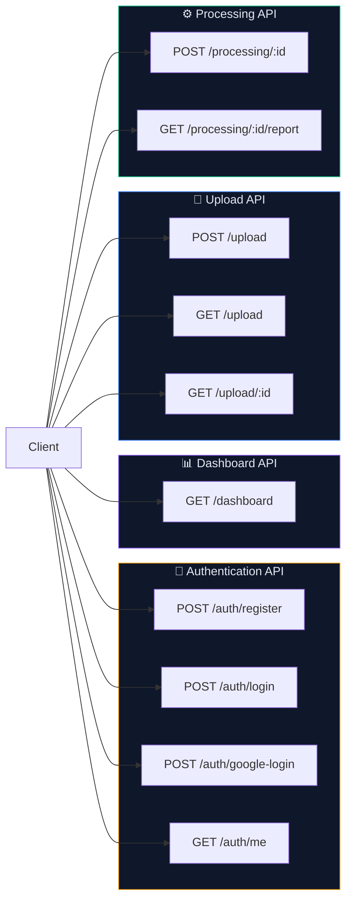

| Endpoint | Method | Auth | Description |
|---|---|---|---|
| `/api/v1/auth/register` | POST | ❌ | Register new user |
| `/api/v1/auth/login` | POST | ❌ | Login with email/password |
| `/api/v1/auth/google-login` | POST | ❌ | Login with Google OAuth |
| `/api/v1/auth/me` | GET | ✅ | Get current user profile |
| `/api/v1/dashboard` | GET | ✅ | Dashboard KPIs, uploads, insights, activity |
| `/api/v1/upload` | POST | ✅ | Upload file (multipart) |
| `/api/v1/upload` | GET | ✅ | List user's datasets |
| `/api/v1/upload/:id` | GET | ✅ | Get dataset by ID |
| `/api/v1/processing/:id` | POST | ✅ | Trigger processing pipeline |
| `/api/v1/processing/:id/report` | GET | ✅ | Get processing report |

---

## Security Architecture

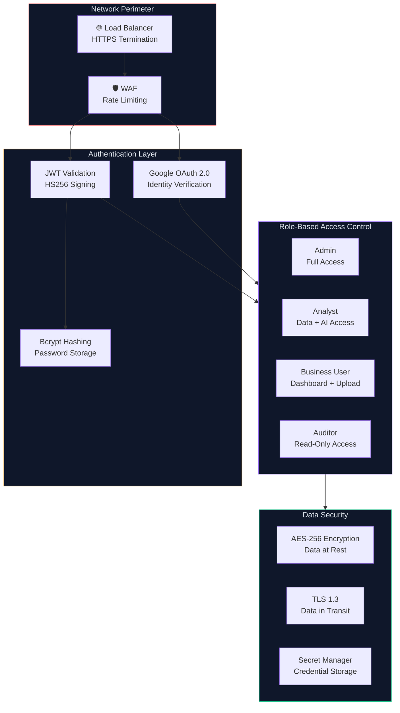

**Explanation:** Security is implemented at multiple layers. Network perimeter with HTTPS and rate limiting. Authentication via Google OAuth and JWT with bcrypt password hashing. Authorization via four RBAC roles with granular permissions. Data protection with encryption at rest and TLS in transit.

---

## Deployment Architecture

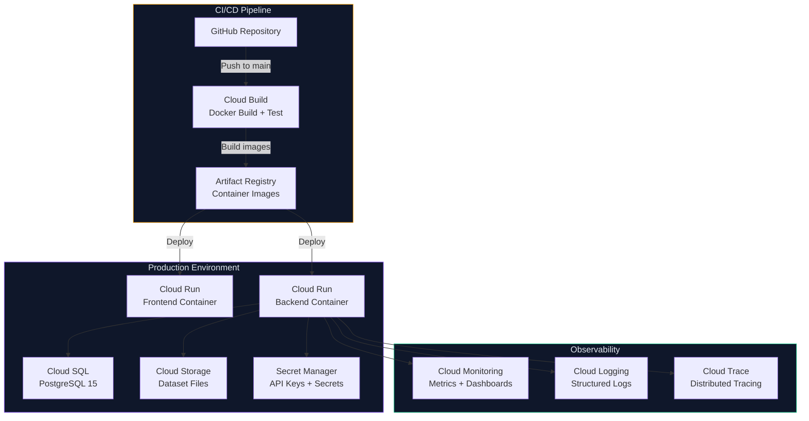

**Explanation:** Production deployment uses Cloud Run for auto-scaling container hosting. Cloud Build runs CI/CD on every push to main — building Docker images, running tests, and deploying to Cloud Run. Cloud SQL provides managed PostgreSQL. Cloud Storage handles file persistence. Secret Manager secures all credentials.

---

## Getting Started

### Prerequisites

- Python 3.12+
- Node.js 20+
- Git

### Quick Start

```bash
# Clone the repository
git clone https://github.com/your-org/decisioniq-ai.git
cd decisioniq-ai

# Backend Setup
python -m venv .venv
.venv/Scripts/activate          # Windows
# source .venv/bin/activate     # macOS/Linux
pip install -r backend/requirements.txt

# Start Backend API
python -m uvicorn backend.app.main:app --host 127.0.0.1 --port 8000

# Frontend Setup (new terminal)
cd frontend
npm install
npm run dev
```

### Access Points

| Service | URL |
|---|---|
| Frontend Application | http://localhost:3000 |
| Backend API | http://localhost:8000 |
| API Documentation (Swagger) | http://localhost:8000/docs |
| API Documentation (ReDoc) | http://localhost:8000/redoc |

### Running Tests

```bash
# Run all 25 integration tests
python -m pytest backend/tests -v

# Run with coverage
python -m pytest backend/tests --cov=backend/app
```

---

## Business Value

| Metric | Before DecisionIQ | After DecisionIQ |
|---|---|---|
| **Data Preparation Time** | 4-6 hours per dataset | Under 2 minutes (automated) |
| **Insight Generation** | 2-3 weeks | Real-time |
| **Decision Latency** | Days to weeks | Minutes |
| **Tool Consolidation** | 5-7 separate tools | Single unified platform |
| **Data Quality Assurance** | Manual spot-checks | Automated quality reports |
| **Audit Compliance** | Fragmented logs | Complete activity audit trail |

---

## Future Enhancements

| Phase | Enhancement | Description |
|---|---|---|
| Phase 2 | **AI Chat Module** | Natural language querying with Gemini integration |
| Phase 2 | **RAG Engine** | Embedding generation + vector search for document-aware AI |
| Phase 3 | **Predictive Analytics** | Time-series forecasting and scenario modeling |
| Phase 3 | **Decision Engine** | Multi-signal synthesis with confidence-scored recommendations |
| Phase 4 | **Report Generation** | Automated business intelligence report creation |
| Phase 4 | **Real-time Alerts** | Anomaly detection with push notifications |
| Phase 5 | **Mobile Application** | Cross-platform mobile client |
| Phase 5 | **Multi-tenant Architecture** | Organization-level isolation and billing |

---

## Testing Strategy

| Test Type | Count | Framework | Description |
|---|---|---|---|
| **Authentication** | 7 | pytest | Registration, login, JWT, RBAC, Google OAuth |
| **Dashboard** | 3 | pytest | Auth guard, empty state, aggregated data |
| **File Upload** | 9 | pytest | Multi-format upload, validation, listing, retrieval |
| **Data Processing** | 6 | pytest | CSV/JSON processing, stats, unsupported types, reports |
| **Total** | **25** | pytest | All passing ✅ |

---

## Architecture Decision Records (ADR)

| ADR | Decision | Rationale |
|---|---|---|
| ADR-001 | Native bcrypt over passlib | passlib has deprecation warnings on Python 3.12+; native bcrypt is actively maintained |
| ADR-002 | SQLite for development | Zero-config local development; production uses Cloud SQL PostgreSQL |
| ADR-003 | StorageService abstraction | Decouple file persistence from cloud provider; swap Local→GCS without code changes |
| ADR-004 | JSON columns for reports | Processing reports have variable schemas per file type; JSON provides flexible evolution |
| ADR-005 | Deterministic sort: `created_at.desc(), id.desc()` | Bulk inserts can have identical timestamps; secondary ID sort ensures stable ordering |
| ADR-006 | TanStack Query over SWR | Superior mutation support, query invalidation, and DevTools for complex data flows |

---

## License

This project is licensed under the MIT License — see the [LICENSE](LICENSE) file for details.

---

<div align="center">

**Built with ❤️ using Google Cloud, Gemini AI, and Modern Web Technologies**

[⬆ Back to Top](#-decisioniq-ai)

</div>
